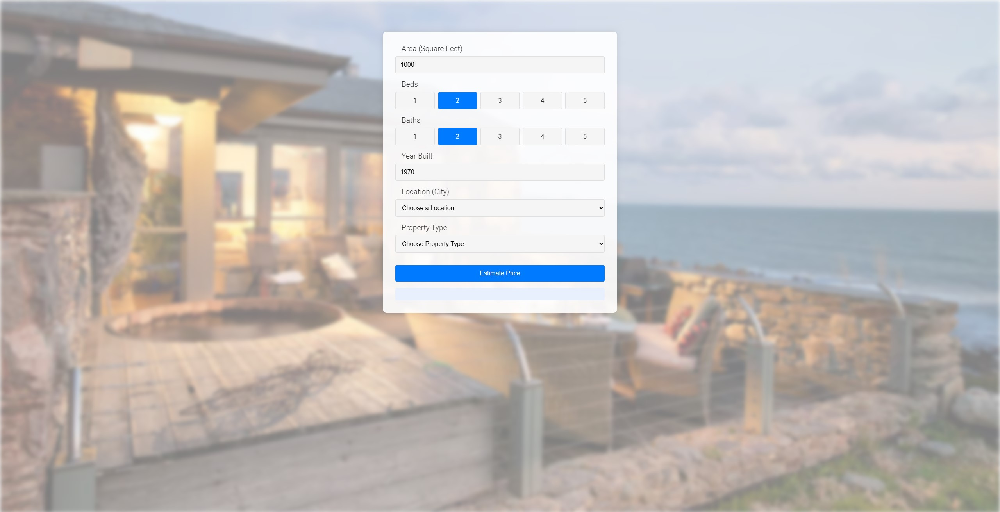

<!-- PROJECT LOGO -->
<br />
<p align="center">
  <a href="https://github.com/Boxi-Lin/socal-home-price-predictor">
    
  </a>

  <h3 align="center">SoCal Home Price Predictor</h3>

  <p align="center">
    A machine learning web application to predict Southern California home prices.
    <br />
    <a href="http://ec2-3-147-205-118.us-east-2.compute.amazonaws.com/">Live Site</a>
  </p>
</p>

---

## About The Project

The **SoCal Home Price Predictor** is a full-stack machine learning web app designed to estimate housing prices in Southern California based on square footage, number of bedrooms and bathrooms, year built, location, and property type.

Key features:
- Dynamic dropdown menu populated from the backend
- Real-time home price predictions
- Clean UI built with HTML/CSS/JS
- Machine learning model built with scikit-learn
- Hosted on AWS EC2 for public access

### Built With
- [Python](https://www.python.org/)
- [Flask](https://flask.palletsprojects.com/)
- [Flask-CORS](https://flask-cors.readthedocs.io/en/latest/)
- [NumPy](https://numpy.org/)
- [scikit-learn](https://scikit-learn.org/)
- [HTML5](https://developer.mozilla.org/en-US/docs/Web/Guide/HTML/HTML5)
- [CSS3](https://developer.mozilla.org/en-US/docs/Web/CSS)
- [JavaScript](https://developer.mozilla.org/en-US/docs/Web/JavaScript) - connects the user interface to the Flask backend
- [Jupyter Notebook](https://jupyter.org/) – for model prototyping
- [AWS EC2](https://aws.amazon.com/ec2/) – for cloud hosting
- [Git](https://git-scm.com/) + [GitHub](https://github.com/) – for version control
- [Visual Studio Code](https://code.visualstudio.com/) / [PyCharm](https://www.jetbrains.com/pycharm/) – for development


---

## Getting Started

### 🔧 Prerequisites

To run the backend server locally, you'll need:

- Python 3 installed
- The following Python packages on your IDE:
```bash
pip install flask flask-cors numpy scikit-learn

## 🚀 How to Use

To run and test the SoCal Home Price Predictor locally:

### 1. Clone the repository

```bash
git clone https://github.com/Boxi-Lin/socal-home-price-predictor.git
cd socal-home-price-predictor
```

### 2. Open your IDE

Open the project folder in your preferred Python IDE (e.g., VS Code or PyCharm).

### 3. Install required packages

In your terminal or IDE, install the required packages:

```bash
pip install flask flask-cors numpy scikit-learn
```

### 4. Run the Flask backend

In your terminal, navigate to the `server` folder and run:

```bash
python server.py
```

### 5. Access the frontend

Once the Flask server is running, either:

- Open `client/app.html` directly in your browser
- Or visit the live version at:  
  [http://ec2-3-147-205-118.us-east-2.compute.amazonaws.com/](http://ec2-3-147-205-118.us-east-2.compute.amazonaws.com/)
